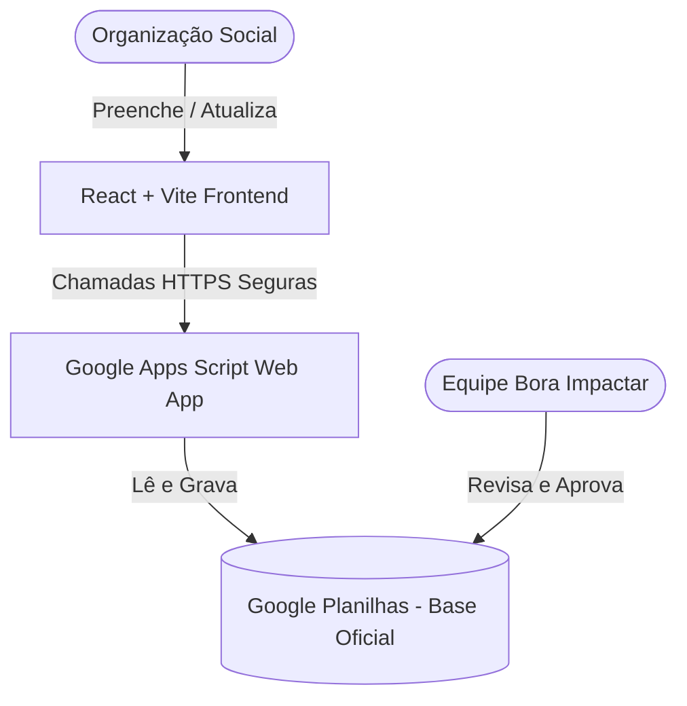
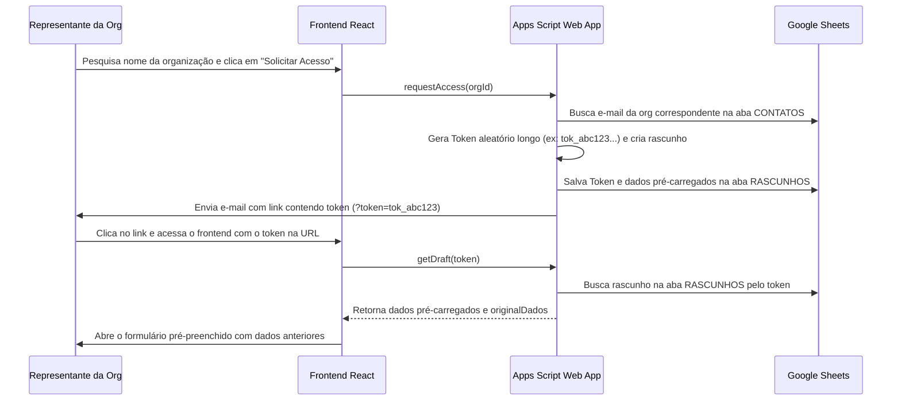
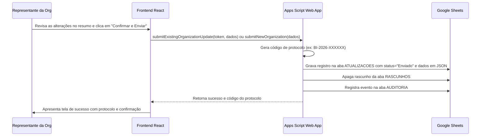

# Arquitetura de Integração — Bora Impactar

Este documento detalha o fluxo arquitetural do **Formulário Inteligente de Atualização Cadastral**, conectando o frontend React ao banco de dados oficial no Google Planilhas de forma segura e em conformidade com a LGPD.

---

## 1. Visão Geral da Arquitetura

O sistema é construído sobre três camadas principais para atingir custo zero, facilidade de manutenção e conformidade regulatória:

1.  **Frontend (React + Vite):** Interface web moderna que coleta, valida e apresenta os dados cadastrais em um wizard intuitivo de 9 etapas.
2.  **API Backend (Google Apps Script Web App):** Um script publicado que age como gateway. Ele gerencia autenticação por token de uso único, lê as planilhas oficiais, gera rascunhos e recebe as submissões finais.
3.  **Banco de Dados (Google Planilhas):** Base oficial estruturada com abas relacionais (`ORGANIZACOES`, `CONTATOS`, `TERRITORIOS`, etc.) controlada por permissões.

---

## 2. Fluxo de Validação de Acesso (Token / Link Seguro)

Para que representantes de organizações possam atualizar seus cadastros com segurança sem precisar fazer login por senha ou expor dados pessoais a terceiros, o sistema utiliza o fluxo de link seguro de uso único:

---

## 3. Fluxo de Submissão Segura (Fila de Aprovação)

Para proteger a integridade do banco de dados principal de erros ou atualizações incorretas, as submissões enviadas pelo formulário **nunca** alteram as abas principais diretamente. Em vez disso, entram em uma fila de triagem técnica na aba `ATUALIZACOES`:

---

## 4. Estrutura de Proteção de Dados (LGPD)

-   **Omissão de Dados Pessoais na Busca Pública:** O endpoint de busca pública retorna exclusivamente: `organizacao_id`, `nome_oficial`, `nome_conhecido`, `bairro` e `situacao_formalizacao`. Nenhuma informação pessoal (nome de responsáveis, e-mails, telefones) ou dados financeiros (faixas de orçamento) são visíveis sem o token seguro.
-   **Validação de E-mail:** O link de acesso seguro é enviado exclusivamente para o e-mail cadastrado previamente na base. Se uma organização deseja alterar o e-mail antes do acesso, deve solicitar suporte oficial.
-   **Auditoria de Eventos:** Cada acesso com token, salvamento de rascunho ou envio final gera uma entrada na aba `AUDITORIA` com data, hora, ação executada e ID da organização, permitindo monitorar o histórico de preenchimento.
